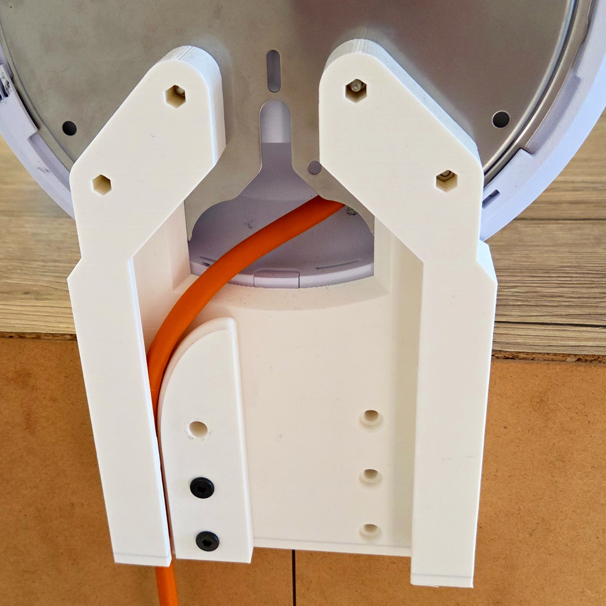

<!-- Begin README -->


<div align="center">
    
    
</div>

<p align="center">
    <a href="https://daringfireball.net/projects/markdown/"></a>
    <a href="https://github.com/bajraan"></a>
    <a href="mailto:bajran1616@gmail.com"></a>
    <br>
</p>


> [!IMPORTANT]
> **in progress.**

```markdown
                   **SCREWS INDEX**
|----------------------------------------------------------------------------------------|
| nr | Part name                             | cnt | Comment                             |
|----|---------------------------------------|-----|-------------------------------------|
| 1  | MOUNT__Stand                          | x 1 | Print                               |
| 2  | HINGE__Cable_Retainer                 | x 1 | Print                               |
| 3  | HINGE__Drill_Guide                    | x 1 | Print                               |
| 4  | Screw DIN7985   M3x20  or any similar | x 2 | Connects steel plate with stand     |
| 5  | Nut             M3     or any similar | x 2 | Connects steel plate with stand     |
| 6  | Screw Furniture M8X55  or any similar | x 4 | Connects furniture back with Stand  |
| 7  | Screw dinisoaaa DIN    or any similar | x 3 | Connects Stand with Cable_Retainer  |
|----------------------------------------------------------------------------------------|
```


<div align="center">
     
</div>

<div align="center">
    
</div>

<div align="center">
    
</div>


<!-- VARIANTS SECTION -->
<!-- VARIANTS SECTION -->
<!-- VARIANTS SECTION -->


<!-- GALLERY SECTION -->
<!-- GALLERY SECTION -->
<!-- GALLERY SECTION -->


<!-- End README -->

<!-- github background #0d1117 -->