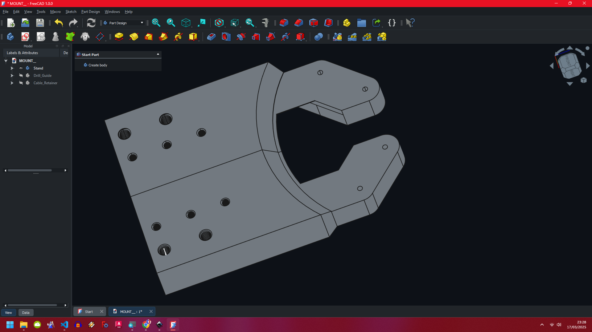
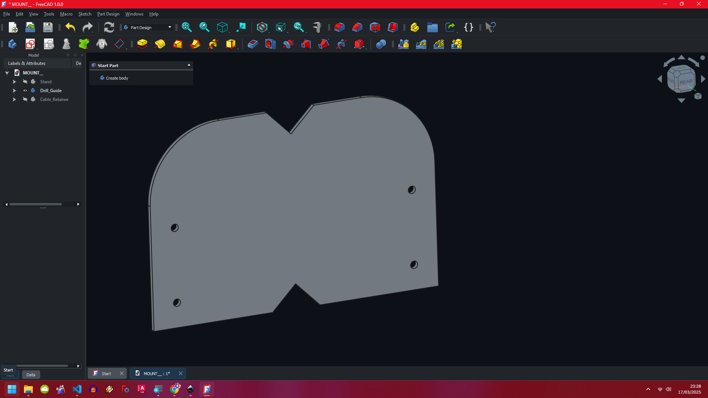
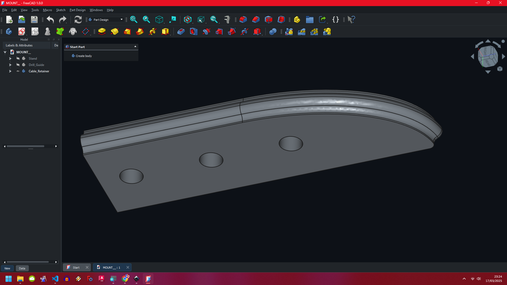

<!-- Begin README -->


<div align="center">
    
    
</div>

<p align="center">
    <a href="https://daringfireball.net/projects/markdown/"></a>
    <a href="https://github.com/bajraan"></a>
    <a href="mailto:bajran1616@gmail.com"></a>
    <br>
</p>


> [!IMPORTANT]
> **in progress.**

```markdown
                   **SCREWS INDEX**
|------------------------------------------------------------------------------------|
| nr | Part name                         | cnt | Comment                             |
|----|-----------------------------------|-----|-------------------------------------|
| 1  | MOUNT__Stand                      | x 1 | Print                               |
| 2  | HINGE__Cable_Retainer             | x 1 | Print                               |
| 3  | HINGE__Drill_Guide                | x 1 | Print                               |
| 4  | Screw  M3x20       or any similar | x 4 | Connects steel plate with stand     |
| 5  | Nut    M3          or any similar | x 4 | Connects steel plate with stand     |
| 6  | Screw  M8X15       or any similar | x 4 | Connects furniture back with Stand  |
| 7  | Screw  M5X20       or any similar | x 4 | Connects Stand with Cable_Retainer  |
|------------------------------------------------------------------------------------|
```


<div align="center">
     
</div>

<div align="center">
     
</div>

<div align="center">
     
</div>


</br></br></br>
<div align="center">
    <figure>
        <figcaption style="text-align: center; font-weight: bold;">Twój podpis nad obrazem</figcaption>
        
    </figure>
</div>

</br></br></br>
<div align="center">
    <figure>
        <figcaption style="text-align: center; font-weight: bold;">Twój podpis nad obrazem</figcaption>
        
    </figure>
</div>

</br></br></br>
<div align="center">
    <figure>
        <figcaption style="text-align: center; font-weight: bold;">Twój podpis nad obrazem</figcaption>
        
    </figure>
</div>

</br></br></br></br></br></br></br>
</br></br></br></br></br></br></br>

<div align="center">
    <p style="text-align: center; font-weight: bold;">Twój podpis nad obrazem</p>
    
</div>

</br></br></br>
<div align="center">
    <p style="text-align: center; font-weight: bold;">Twój podpis nad obrazem</p>
    
</div>

</br></br></br>
<div align="center">
    <p style="text-align: center; font-weight: bold;">Twój podpis nad obrazem</p>
    
</div>

<!-- VARIANTS SECTION -->
<!-- VARIANTS SECTION -->
<!-- VARIANTS SECTION -->

<!-- GALLERY SECTION -->
<!-- GALLERY SECTION -->
<!-- GALLERY SECTION -->

<div align="center">
    
    
</div>

<!-- End README -->
<!-- github background #0d1117 -->